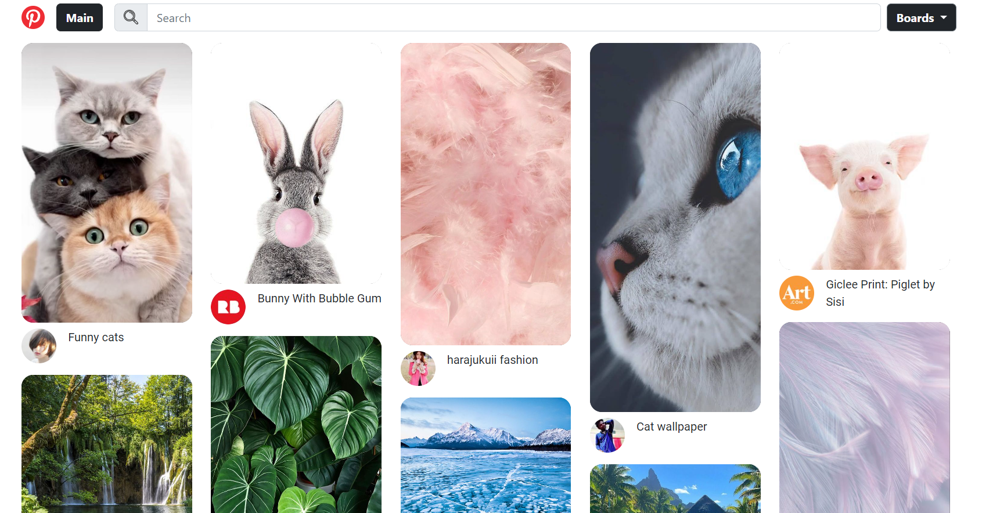

<div id="top"></div>

<!-- PROJECT LOGO -->
<br />
<div align="center">
  <a href="https://github.com/github_username/repo_name">
    
  </a>

<h3 align="center">Pintasy</h3>

  <p align="center">
    Pinterest simple copy. Course project
    <br />
    <a href="https://github.com/OlgaUsovich/Pintasy"><strong>Explore the docs »</strong></a>
  </p>
</div>

<!-- ABOUT THE PROJECT -->
## About The Project



<p align="right">(<a href="#top">back to top</a>)</p>

### Built With

* [JavaScript](https://developer.mozilla.org/en-US/)
* [Parcel](https://parceljs.org/)
* [Node.js](https://nodejs.org/en/)
* [Bootstrap](https://getbootstrap.com)
* [Sass](https://sass-lang.com/)

<p align="right">(<a href="#top">back to top</a>)</p>

<!-- GETTING STARTED -->
### Launch the project

1. Clone the repo
   ```sh
   git clone https://github.com/OlgaUsovich/Pintasy.git
   ```
2. Install NPM packages
   ```sh
   npm install
   ```
3. Run project
   ```sh
   npm run dev
   ```

<p align="right">(<a href="#top">back to top</a>)</p>

<!-- ROADMAP -->
## Roadmap

- [x] Add a card to a board
- [x] Complain about a card
- [x] Show board
- [x] Search
- [ ] Add a board
- [ ] Delete a card from a board
- [ ] Add a card

<p align="right">(<a href="#top">back to top</a>)</p>

<!-- CONTACT -->
## Contact

Project Link: [https://github.com/OlgaUsovich/Pintasy](https://github.com/OlgaUsovich/Pintasy)

<p align="right">(<a href="#top">back to top</a>)</p>

<!-- ACKNOWLEDGMENTS -->
## Acknowledgments

* [Masonry](https://masonry.desandro.com/)

<p align="right">(<a href="#top">back to top</a>)</p>
